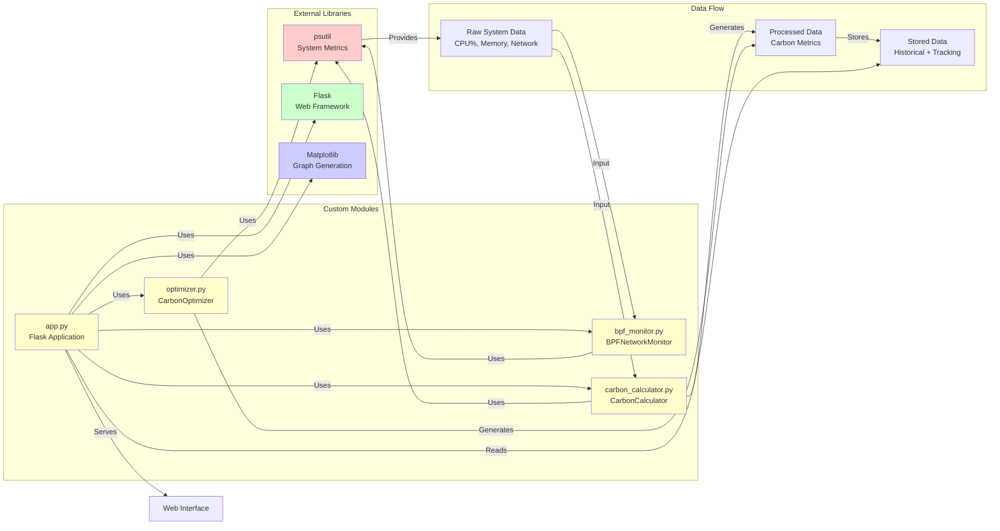
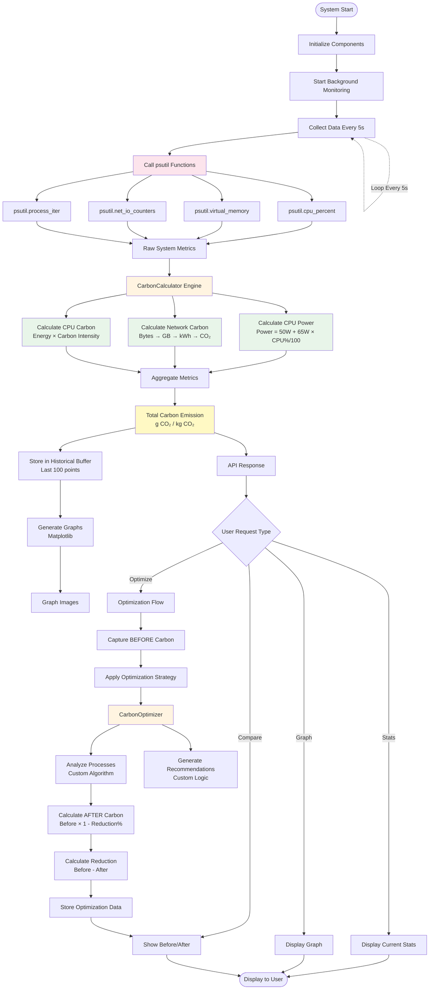
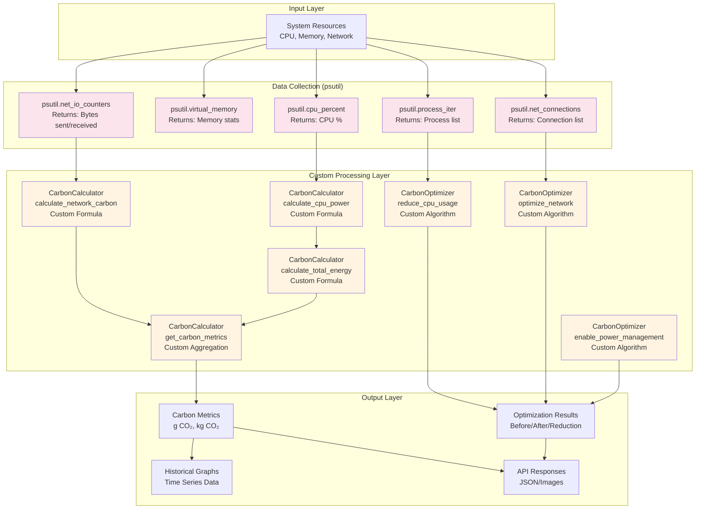

# System Architecture Diagram - Carbon Emission Prediction (CEP) System

## High-Level Architecture Flow

```mermaid
graph TB
    subgraph "User Interface Layer"
        UI[Web Dashboard<br/>HTML/CSS/JavaScript]
    end
    
    subgraph "Application Layer (Flask)"
        API1[/api/stats<br/>Get System Stats]
        API2[/api/optimize<br/>Apply Optimization]
        API3[/api/optimization-data<br/>Before/After Data]
        API4[/api/graph/<type><br/>Generate Graphs]
        API5[/api/savings<br/>Estimate Savings]
    end
    
    subgraph "Data Collection Layer"
        MONITOR[BPFNetworkMonitor<br/>bpf_monitor.py]
        PSUTIL[psutil Library<br/>System Metrics]
    end
    
    subgraph "Core Calculation Engine"
        CALC[CarbonCalculator<br/>carbon_calculator.py]
        OPT[CarbonOptimizer<br/>optimizer.py]
    end
    
    subgraph "Data Storage"
        HIST[Historical Data<br/>Circular Buffer]
        OPT_DATA[Optimization Data<br/>Before/After Tracking]
    end
    
    subgraph "System Resources"
        CPU[CPU Usage %]
        MEM[Memory Usage]
        NET[Network I/O<br/>Bytes/Packets]
        PROC[Process List]
    end
    
    subgraph "Output/Visualization"
        GRAPH[Matplotlib Graphs<br/>CPU/Network/Carbon/Energy]
        METRICS[Carbon Metrics<br/>g CO₂ / kg CO₂]
        COMPARE[Before/After<br/>Comparison]
    end
    
    %% User interactions
    UI -->|HTTP Requests| API1
    UI -->|HTTP Requests| API2
    UI -->|HTTP Requests| API3
    UI -->|HTTP Requests| API4
    UI -->|HTTP Requests| API5
    
    %% API to Monitor
    API1 -->|Get Stats| MONITOR
    API2 -->|Get Stats| MONITOR
    API3 -->|Read Data| OPT_DATA
    API4 -->|Read Data| HIST
    API5 -->|Get Savings| CALC
    
    %% Monitor to psutil
    MONITOR -->|Collect Metrics| PSUTIL
    PSUTIL -->|Read| CPU
    PSUTIL -->|Read| MEM
    PSUTIL -->|Read| NET
    PSUTIL -->|Read| PROC
    
    %% Monitor to Calculator
    MONITOR -->|Network Stats| CALC
    PSUTIL -->|CPU/Memory Data| CALC
    
    %% Calculator processing
    CALC -->|Calculate Carbon| METRICS
    CALC -->|Store Metrics| HIST
    CALC -->|Calculate Power/Energy| METRICS
    
    %% Optimization flow
    API2 -->|Apply Strategy| OPT
    OPT -->|Analyze Processes| PSUTIL
    OPT -->|Get Current Carbon| CALC
    OPT -->|Store Results| OPT_DATA
    OPT -->|Calculate Reduction| OPT_DATA
    
    %% Graph generation
    API4 -->|Generate| GRAPH
    HIST -->|Time Series Data| GRAPH
    
    %% Response flow
    API1 -->|JSON Response| UI
    API2 -->|JSON Response| UI
    API3 -->|JSON Response| UI
    API4 -->|Base64 Image| UI
    API5 -->|JSON Response| UI
    
    %% Comparison display
    OPT_DATA -->|Before/After Data| COMPARE
    COMPARE -->|Display| UI
    
    style UI fill:#e1f5ff
    style CALC fill:#fff4e1
    style OPT fill:#fff4e1
    style MONITOR fill:#e8f5e9
    style PSUTIL fill:#fce4ec
    style HIST fill:#f3e5f5
    style OPT_DATA fill:#f3e5f5
    style METRICS fill:#fff9c4
    style GRAPH fill:#fff9c4
    style COMPARE fill:#fff9c4
```

## Detailed Component Flow

```mermaid
sequenceDiagram
    participant User
    participant UI as Web Dashboard
    participant API as Flask API
    participant Monitor as BPFNetworkMonitor
    participant psutil as psutil Library
    participant Calc as CarbonCalculator
    participant Opt as CarbonOptimizer
    participant Storage as Data Storage
    
    Note over User,Storage: System Initialization
    Monitor->>psutil: Initialize monitoring
    Monitor->>Monitor: Start background thread
    
    Note over User,Storage: Real-time Data Collection (Every 5 seconds)
    loop Continuous Monitoring
        Monitor->>psutil: Get CPU usage %
        psutil-->>Monitor: cpu_percent
        Monitor->>psutil: Get network I/O
        psutil-->>Monitor: bytes_sent, bytes_recv
        Monitor->>psutil: Get memory stats
        psutil-->>Monitor: memory_percent
        Monitor->>Calc: Pass network stats
        Calc->>psutil: Get CPU usage
        psutil-->>Calc: cpu_percent
        Calc->>Calc: Calculate CPU power (Custom formula)
        Calc->>Calc: Calculate network carbon (Custom formula)
        Calc->>Calc: Calculate total carbon (Custom aggregation)
        Calc->>Storage: Store historical data
    end
    
    Note over User,Storage: User Requests Stats
    User->>UI: Load dashboard
    UI->>API: GET /api/stats
    API->>Monitor: Get current stats
    Monitor->>psutil: Get latest metrics
    psutil-->>Monitor: System metrics
    Monitor-->>API: Network stats
    API->>Calc: Calculate carbon metrics
    Calc->>Calc: Apply custom formulas
    Calc-->>API: Carbon metrics (g CO₂)
    API-->>UI: JSON response
    UI-->>User: Display stats
    
    Note over User,Storage: User Applies Optimization
    User->>UI: Click "Apply Optimization"
    UI->>API: POST /api/optimize
    API->>Calc: Get current carbon (BEFORE)
    Calc-->>API: before_carbon_g
    API->>Opt: Apply optimization strategy
    Opt->>psutil: Get process list
    psutil-->>Opt: Process data
    Opt->>Opt: Analyze high-CPU processes (Custom algorithm)
    Opt->>Opt: Generate recommendations (Custom logic)
    Opt-->>API: Optimization result
    API->>API: Calculate AFTER carbon (Custom formula)
    API->>API: Calculate reduction (Custom formula)
    API->>Storage: Store before/after data
    API-->>UI: Optimization result + before/after data
    UI-->>User: Show comparison
    
    Note over User,Storage: User Views Graphs
    User->>UI: View graphs
    UI->>API: GET /api/graph/carbon
    API->>Storage: Get historical data
    Storage-->>API: Time series data
    API->>API: Generate matplotlib graph
    API-->>UI: Base64 encoded image
    UI-->>User: Display graph
```

## Package/Module Flow Diagram



## Data Flow Architecture



## Component Interaction Diagram



## System Architecture Overview (Text-Based)

```
┌─────────────────────────────────────────────────────────────────┐
│                    USER INTERFACE LAYER                         │
│              (Web Dashboard - HTML/CSS/JavaScript)              │
└────────────────────────────┬────────────────────────────────────┘
                             │ HTTP Requests
                             ▼
┌─────────────────────────────────────────────────────────────────┐
│                    FLASK APPLICATION LAYER                      │
│                          (app.py)                               │
│  ┌──────────┐  ┌──────────┐  ┌──────────┐  ┌──────────┐      │
│  │/api/stats│  │/api/     │  │/api/     │  │/api/     │      │
│  │          │  │optimize  │  │optimization│ │graph/   │      │
│  │          │  │          │  │-data     │  │<type>    │      │
│  └────┬─────┘  └────┬─────┘  └────┬─────┘  └────┬─────┘      │
└───────┼─────────────┼─────────────┼─────────────┼────────────┘
        │             │             │             │
        ▼             ▼             ▼             ▼
┌─────────────────────────────────────────────────────────────────┐
│                    DATA COLLECTION LAYER                        │
│              (BPFNetworkMonitor - bpf_monitor.py)               │
│                                                                 │
│  Uses psutil for:                                              │
│  • psutil.cpu_percent()      → CPU usage %                    │
│  • psutil.virtual_memory()   → Memory stats                   │
│  • psutil.net_io_counters()  → Network bytes                  │
│  • psutil.process_iter()      → Process list                  │
│  • psutil.net_connections()  → Connection list               │
└────────────────────────────┬────────────────────────────────────┘
                             │ Raw System Metrics
                             ▼
┌─────────────────────────────────────────────────────────────────┐
│              CORE CALCULATION ENGINE                            │
│                                                                 │
│  ┌──────────────────────────────────────────────────────────┐  │
│  │  CarbonCalculator (carbon_calculator.py)                 │  │
│  │  ┌────────────────────────────────────────────────────┐  │  │
│  │  │ calculate_cpu_power()                              │  │  │
│  │  │   Power = 50W + (65W × CPU%/100)  [CUSTOM]        │  │  │
│  │  └────────────────────────────────────────────────────┘  │  │
│  │  ┌────────────────────────────────────────────────────┐  │  │
│  │  │ calculate_network_carbon()                         │  │  │
│  │  │   Bytes → GB → kWh → CO₂  [CUSTOM]                 │  │  │
│  │  └────────────────────────────────────────────────────┘  │  │
│  │  ┌────────────────────────────────────────────────────┐  │  │
│  │  │ calculate_total_energy()                            │  │  │
│  │  │   Energy = (Power × Time) / 1000  [CUSTOM]         │  │  │
│  │  └────────────────────────────────────────────────────┘  │  │
│  │  ┌────────────────────────────────────────────────────┐  │  │
│  │  │ get_carbon_metrics()                               │  │  │
│  │  │   Aggregates all metrics  [CUSTOM]                  │  │  │
│  │  └────────────────────────────────────────────────────┘  │  │
│  └──────────────────────────────────────────────────────────┘  │
│                                                                 │
│  ┌──────────────────────────────────────────────────────────┐  │
│  │  CarbonOptimizer (optimizer.py)                         │  │
│  │  ┌────────────────────────────────────────────────────┐  │  │
│  │  │ reduce_cpu_usage()                                 │  │  │
│  │  │   Analyzes processes >50% CPU  [CUSTOM]            │  │  │
│  │  └────────────────────────────────────────────────────┘  │  │
│  │  ┌────────────────────────────────────────────────────┐  │  │
│  │  │ optimize_network()                                 │  │  │
│  │  │   Network analysis & recommendations  [CUSTOM]    │  │  │
│  │  └────────────────────────────────────────────────────┘  │  │
│  │  ┌────────────────────────────────────────────────────┐  │  │
│  │  │ enable_power_management()                         │  │  │
│  │  │   Power saving strategies  [CUSTOM]               │  │  │
│  │  └────────────────────────────────────────────────────┘  │  │
│  └──────────────────────────────────────────────────────────┘  │
└────────────────────────────┬────────────────────────────────────┘
                             │ Processed Data
                             ▼
┌─────────────────────────────────────────────────────────────────┐
│                    DATA STORAGE LAYER                           │
│                                                                 │
│  Historical Data (Circular Buffer - Last 100 points):          │
│  • Timestamps                                                  │
│  • CPU usage history                                           │
│  • Network traffic history                                     │
│  • Carbon emissions history                                    │
│  • Energy consumption history                                  │
│                                                                 │
│  Optimization Data (Before/After Tracking):                   │
│  • before_carbon_g                                             │
│  • after_carbon_g                                              │
│  • reduction_g                                                 │
│  • reduction_percent                                           │
│  • optimization_type                                           │
└────────────────────────────┬────────────────────────────────────┘
                             │
                             ▼
┌─────────────────────────────────────────────────────────────────┐
│                  OUTPUT/VISUALIZATION LAYER                     │
│                                                                 │
│  • Carbon Metrics (g CO₂, kg CO₂)                              │
│  • Before/After Comparison                                     │
│  • Matplotlib Graphs (CPU/Network/Carbon/Energy)                │
│  • API JSON Responses                                          │
│  • Real-time Dashboard Updates                                 │
└─────────────────────────────────────────────────────────────────┘
```

## How to Use These Diagrams

1. **Mermaid Diagrams**: 
   - Can be viewed in GitHub, GitLab, or any Markdown viewer with Mermaid support
   - Can be exported as images using tools like:
     - [Mermaid Live Editor](https://mermaid.live/) - Copy the mermaid code and export as PNG/SVG
     - VS Code with Mermaid extension
     - Online Mermaid renderers

2. **Text-Based Diagram**: 
   - Already in text format, can be copied directly
   - Can be converted to image using ASCII art tools

3. **Recommended Tool**: 
   - Use [Mermaid Live Editor](https://mermaid.live/)
   - Copy any of the mermaid code blocks
   - Click "Actions" → "Download PNG" or "Download SVG"

## Key Points Shown in Diagrams

1. **psutil Usage**: Only in Data Collection Layer (shown in pink/red)
2. **Custom Components**: Calculation Engine and Optimizer (shown in yellow)
3. **Data Flow**: From system → psutil → custom processing → output
4. **Package Flow**: How different modules interact
5. **Sequence Diagram**: Step-by-step process flow
6. **Component Interaction**: Detailed interaction between components

---

**Note**: To download these diagrams as images:
1. Go to https://mermaid.live/
2. Copy the mermaid code from any diagram above
3. Paste it in the editor
4. Click "Actions" → "Download PNG" or "Download SVG"

